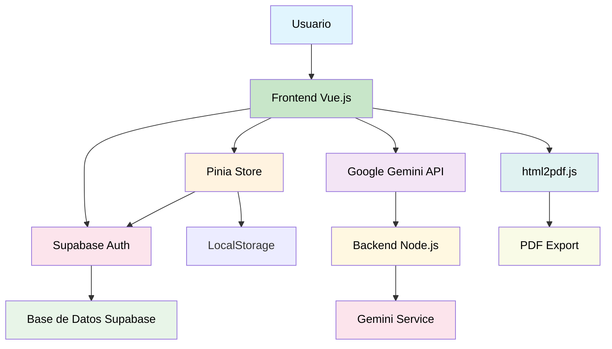

# 🚀 Craft.IA: Generador Inteligente de CVs

<div align="center">
  
  
  
  
  
</div>

<br />

**Craft.IA** es una aplicación revolucionaria que transforma la creación de currículums en una experiencia estratégica y personalizada. Utilizando inteligencia artificial avanzada (Google Gemini), guía al usuario paso a paso para construir perfiles profesionales optimizados bajo estándares internacionales como Harvard, ATS y Europass, con exportación precisa a PDF de alta calidad.

## ✨ Características Principales

- 🎯 **Optimización ATS**: CVs diseñados para superar filtros automáticos de reclutamiento
- 🤖 **IA Interactiva**: Chat en tiempo real con un "experto en reclutamiento" virtual
- 📱 **Interfaz Moderna**: UI/UX con Glassmorphism, animaciones y diseño responsive
- 🔒 **Autenticación Segura**: Gestión de usuarios con Supabase
- 📄 **Exportación Profesional**: PDFs de calidad imprenta con márgenes precisos
- 💾 **Historial de Versiones**: Guarda y edita múltiples versiones de tu CV

---

## 🏗️ Arquitectura del Sistema

### Diagrama de Arquitectura




### Componentes Arquitectónicos

- **Frontend (Vue.js + Vite)**: Interfaz de usuario reactiva con Composition API
- **Estado Global (Pinia)**: Gestión centralizada de datos del CV y chat
- **Backend (Node.js + Express)**: API REST para integración con Gemini
- **Base de Datos (Supabase)**: PostgreSQL con autenticación y RLS
- **IA Engine (Google Gemini)**: Procesamiento de lenguaje natural y optimización de contenido
- **Exportación (html2pdf.js)**: Conversión de HTML a PDF con alta fidelidad

### Flujo de Datos

1. **Creación**: Usuario ingresa datos → IA optimiza contenido → Almacenamiento local
2. **Interacción**: Chat con IA → Actualización en tiempo real del CV
3. **Persistencia**: Guardado en Supabase → Historial de versiones
4. **Exportación**: Renderizado HTML → Conversión a PDF → Descarga

---

## 🛠️ Instalación y Configuración Local

### Prerrequisitos

- **Node.js** >= 18.0.0
- **npm** >= 8.0.0
- **Git**
- Cuenta de **Google AI Studio** (para Gemini API)
- Cuenta de **Supabase** (para base de datos)

### 1. Clonar el Repositorio

```bash
git clone https://github.com/tu-usuario/craft-ia.git
cd craft-ia
```

### 2. Configurar el Backend

```bash
cd backend
npm install
```

Crear archivo `.env` en `backend/`:

```env
# Puerto del servidor
PORT=3000

# Google Gemini API Key
GEMINI_API_KEY=tu_clave_de_gemini_aqui

# Supabase Configuration
SUPABASE_URL=https://tu-proyecto.supabase.co
SUPABASE_SERVICE_ROLE_KEY=tu_service_role_key_aqui
```

### 3. Configurar el Frontend

```bash
cd ../frontend
npm install
```

Crear archivo `.env` en `frontend/`:

```env
# Google Gemini API Key (para desarrollo local)
VITE_GEMINI_API_KEY=tu_clave_de_gemini_aqui

# Supabase Configuration
VITE_SUPABASE_URL=https://tu-proyecto.supabase.co
VITE_SUPABASE_ANON_KEY=tu_anon_key_aqui
```

### 4. Configurar la Base de Datos

Ejecutar las migraciones de Supabase:

```bash
cd ../supabase
npx supabase db push
```

O aplicar manualmente los archivos SQL en `supabase/migrations/`.

### 5. Ejecutar la Aplicación

**Backend:**
```bash
cd backend
npm run dev
```

**Frontend:**
```bash
cd frontend
npm run dev
```

Acceder a `http://localhost:5173` para el frontend y `http://localhost:3000` para la API.

### 6. Configuración de Producción

Para despliegue en Vercel/Netlify:

1. Configurar variables de entorno en el dashboard
2. Crear `vercel.json`:
```json
{
  "rewrites": [{ "source": "/(.*)", "destination": "/index.html" }]
}
```

---
## 🤖 Inteligencia Artificial: El Motor de Craft.IA

### 🛠️ Desarrollo Potenciado por IA (AI-Pair Programming)

Este proyecto no solo implementa IA, fue construido **en simbiosis** con ella, utilizando un flujo de trabajo de próxima generación:

* **Cursor IDE & Composer**: Pieza clave en la arquitectura. Se utilizó para la refactorización de lógica compleja en Pinia y la generación de componentes reactivos con una velocidad 3x superior al desarrollo tradicional.
* **Prompt Engineering de Precisión**: Diseño de prompts sistémicos para que Gemini respete estrictamente los márgenes A4 y las reglas de parseo de los sistemas ATS (Applicant Tracking Systems).
* **Debugging Evolutivo**: Uso de Gemini para el análisis de trazas de error en tiempo real y la optimización de la performance del renderizado del PDF.

### 🧠 Funcionalidades de IA en la Aplicación

La IA de Craft.IA actúa como un **Career Coach** activo, no como una simple plantilla:

1.  **Análisis de Intención Profesional**: Al inicio, la IA detecta si tu objetivo es académico (maestría/beca) o corporativo, ajustando el lenguaje técnico y el tono automáticamente.
2.  **Optimización Semántica ATS**: Transforma descripciones planas en logros cuantificables (utilizando el método Google XYZ) para maximizar la lectura por algoritmos de reclutamiento.
3.  **Copiloto de Edición (Chat)**: Un chat persistente permite refinar secciones mediante lenguaje natural. Ejemplo: *"Haz que mi experiencia en ventas suene más orientada a datos"*.

---

## 💾 El Diferencial: Persistencia Inteligente

A diferencia de otros generadores, Craft.IA ofrece un **Ecosistema de Carrera** mediante el registro de usuario:

* **Biblioteca de CVs Dinámica**: Los usuarios registrados pueden guardar múltiples versiones de su CV en la nube (vía Supabase).
* **Modificación Evolutiva**: No empiezas de cero. Puedes tomar un CV guardado hace meses y pedirle a la IA: *"Actualízalo con mi nuevo proyecto de Vue.js"* o *"Adáptalo para esta nueva oferta de trabajo de Senior Dev"*.
* **Sincronización Total**: Tu progreso se guarda automáticamente, permitiendo empezar el CV en el móvil y terminar los detalles finos en la PC.

---

## 🚀 Hoja de Ruta (Roadmap)

### 🎯 Fase 1: Gestión Avanzada (Próximamente)
- **💾 Repositorio Personal de CVs**: Guardar Cvs y generarlos a partir de antiguos Cvs.
- **📊 Tracking de Aplicaciones**: Panel para marcar a qué empresas enviaste cada versión de tu CV.
- **🔄 Rollback de Versiones**: Historial de cambios para volver a una versión anterior del texto generada por la IA.
- **🌐 Localización Inteligente**: Traducción técnica de CVs (ej. de Español a Inglés técnico) manteniendo la coherencia profesional.

### 💡 Fase 2: UX & Customización
- **🎨 Constructor Visual Drag & Drop**: Reordenar secciones físicamente con `vuedraggable`.
- **🌙 Sistema de Temas**: Modo oscuro nativo y paletas de colores profesionales preconfiguradas.
- **✨ Micro-interacciones**: Feedback visual mediante animaciones fluidas para una experiencia Premium.

### 💼 Modelo de Negocio (Monetización)
- **Plan Starter (Gratis)**: 1 CV activo, estándares básicos y descargas limitadas.
- **Plan Pro (Suscripción)**: Historial ilimitado de CVs, Chat de IA ilimitado y descarga de plantillas exclusivas.
- **Plan Enterprise**: Solución para agencias de *outplacement* o universidades.

---

## 📝 Guía de Uso

1. **Registro/Login**: Crea una cuenta o inicia sesión, o simplemente como invitado.
2.  **Definición de Meta**: Indica tu objetivo (Trabajo, Beca, etc.) además de ingresar la descripción del puesto o beca, etc para que la IA configure el contexto.
3.  **Selección de Estándar**: Elige Harvard, Creativo, Europass, etc.
4.  **Construcción Guiada**: Completa tus datos mientras la IA sugiere mejoras en tiempo real.
5.  **Refinamiento mediante Chat**: Usa el asistente para pulir logros o resumir experiencias extensas.
6.  **Exportación**: Obtén un PDF optimizado y listo para enviar.

---

## 🤝 Contribución

¡Las contribuciones son bienvenidas! Por favor:

1. Fork el proyecto
2. Crea una rama para tu feature (`git checkout -b feature/AmazingFeature`)
3. Commit tus cambios (`git commit -m 'Add some AmazingFeature'`)
4. Push a la rama (`git push origin feature/AmazingFeature`)
5. Abre un Pull Request
---

<div align="center">
  Desarrollado con ❤️ utilizando Vue 3, Gemini AI y Cursor
</div>